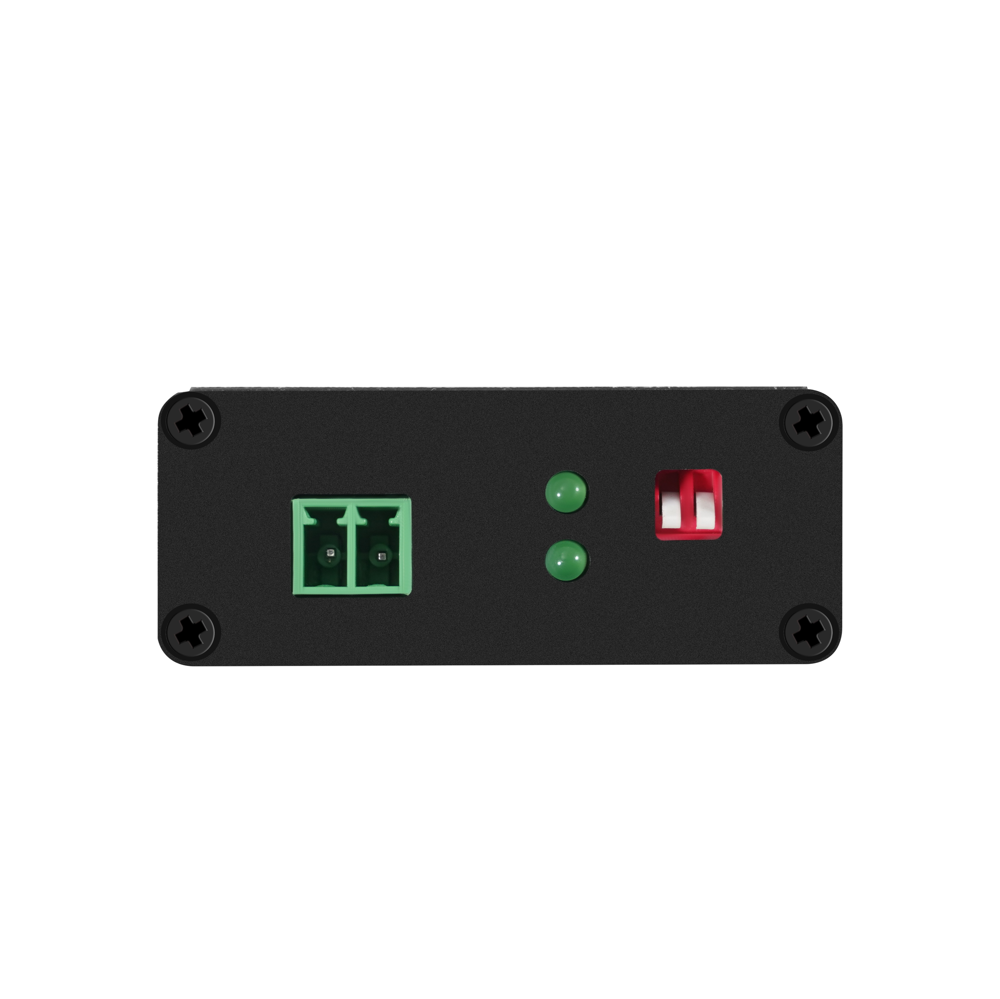
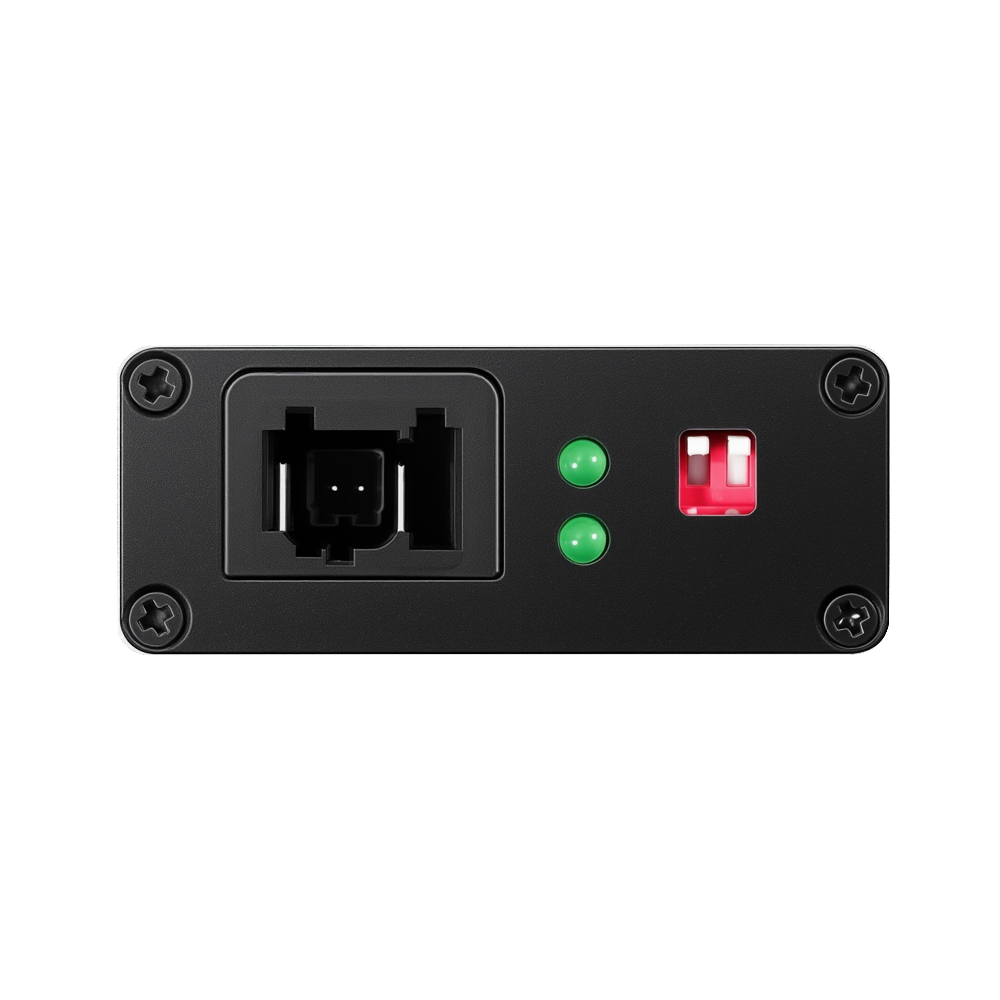
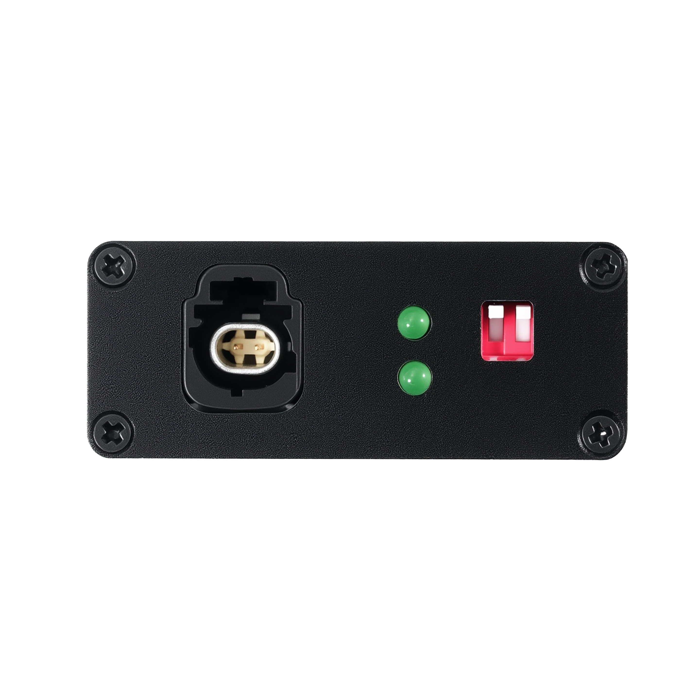

# 100-1000Base-T1-Tx-E Series Automotive Media Converter

The **100-1000Base-T1-Tx-E Series** provides high-performance, low-cost automotive Ethernet media conversion. Based on the **Marvell 88Q2112** (T1 PHY) and **Realtek RTL8211FI** (TX PHY), these devices enable seamless bi-directional communication between standard RJ45 Ethernet and automotive single-pair Ethernet.

---

## Product Selection Guide

| Product Name | Connector Type | Product Image | Documentation |
| :--- | :--- | :--- | :--- |
| **100/1000Base-T1-TX-E** | 3.81mm Terminal Block |  | [User Manual V12](./100-1000Base-T1-TX-E%20User%20Manual%20v12.pdf) |
| **100/1000Base-T1-TX-TE** | TE MATE-NET Connector |  | [User Manual V12](./100-1000Base-T1-TX-TE%20User%20Manual%20V12.pdf) |
| **100/1000Base-T1-TX-HMTD** | Rosenberger HMTD Connector |  | [User Manual V12](./100-1000Base-T1-TX-HMTD-V12.pdf) |

---

## Key Features

*   **High-Speed Conversion**: Supports both 100BASE-T1 and 1000BASE-T1 automotive Ethernet standards.
*   **Proven Chipset**: Marvell 88Q2112 (T1) + Realtek RTL8211FI (TX) for reliable, low-latency performance.
*   **Industrial Grade**: Designed for harsh environments with an operating temperature range of -45°C to +85°C.
*   **Flexible Power**: Supports USB Type-C (5V) and wide-range DC input (5-36V).
*   **Status Monitoring**: Integrated LEDs for Link, Activity, and Signal Quality Indicator (SQI).

---

## Repository Structure

*   [`images/`](./images/): High-resolution product photos.
*   [`Linux_Python/`](./Linux_Python/): Automation scripts for IP setup and performance testing (iperf3).
*   [`Win_Soft/`](./Win_Soft/): iperf3 binaries for Windows.
*   `*.pdf`: Comprehensive technical user manuals for each model.

---

## Support

## Typical Applications

```
PC / ARM ←→ RJ45 ←→ [100/1000Base-T1-TX-E] ←→ Automotive ECU / ADAS Camera / Radar
```

| Input Protocol | Output Protocol | Use Cases |
| :--- | :--- | :--- |
| 100BASE-TX | 100BASE-T1 | Vehicle diagnostics (DoIP), smart cockpit flashing, ADAS sensor debugging |
| 1000BASE-TX | 1000BASE-T1 | High-speed camera/radar data, ECU programming, R&D testing |

---

## Product Specifications

| Parameter | Specification |
| :--- | :--- |
| T1 PHY | Marvell 88Q2112 |
| TX PHY | Realtek RTL8211FI |
| Standards | IEEE 802.3bw (100BASE-T1), IEEE 802.3bp (1000BASE-T1), IEEE 802.3ab (1000BASE-T) |
| Input Voltage | USB Type-C 5V ± 0.5V / DC Jack 6–30V |
| Operating Current | ≤ 355mA |
| Operating Temperature | -40°C to +85°C |
| Operating Humidity | 0–95% RH (non-condensing) |
| Dimensions (L × H × W) | 50mm × 20mm × 83mm |
| Features | IEEE 802.1Q VLAN, QoS, ESD/OVP/OCP protection |

---

## T1 Transmission Distance

| T1 Speed | Cable Type | Max Distance |
| :--- | :--- | :--- |
| 100BASE-T1 | UTP | 20 m |
| 100BASE-T1 | STP | 50 m |
| 1000BASE-T1 | UTP | 15 m |
| 1000BASE-T1 | STP | 40 m |

---

## DIP Switch Configuration

The device has two DIP switches on the enclosure:

| Switch | UP | DOWN |
| :--- | :--- | :--- |
| **100M / 1000M** | 1000Mbps | 100Mbps |
| **Master / Slave** | Master | Slave |

> **Note:** When connecting two converters back-to-back, set one as **Master** and the other as **Slave**.

---

## Quick Start Guide

### Linux (Raspberry Pi 5)

**1. Install iperf3**
```bash
sudo apt-get install iperf3
```
> Do **not** enable iperf3 as a daemon, or it may fail on next boot.

**2. Clone this repo**
```bash
git clone https://github.com/buelec-tech/100-1000Base-T1-Tx-E.git
```

**3. Disable Wi-Fi and configure static IP**

Host A (Client):
```bash
sudo ifconfig eth0 down
sudo ifconfig eth0 190.19.1.9
sudo ifconfig eth0 up
```

Host B (Server):
```bash
sudo ifconfig eth0 down
sudo ifconfig eth0 190.19.1.90
sudo ifconfig eth0 up
```

**4. Verify connectivity**
```bash
sudo ping 190.19.1.90
```

**5. Run iperf3 test**

TCP test:
```bash
# Host B (server)
sudo iperf3 -s

# Host A (client)
sudo iperf3 -c 190.19.1.90 -n 8000M -i 30
```

UDP test:
```bash
# Host A (client)
sudo iperf3 -c 190.19.1.90 -u -b 8000M -l 8k -n 1000M
```

Or use the Python scripts in `Linux_Python/`:
- `190.19.1.9/` — Client-side scripts (setip, ping, iperf3-send-client)
- `190.19.1.90/` — Server-side scripts (setip, ping, iperf3-server)

### Windows

**1. Download iperf3** from [`Win_Soft/iperf3.6_64bit.zip`](./Win_Soft/iperf3.6_64bit.zip) and unzip.

**2. Disable firewalls** on both computers.

**3. Set static IPs**

| | Computer A (Client) | Computer B (Server) |
| :--- | :--- | :--- |
| IP | 190.19.1.9 | 190.19.1.90 |
| Subnet | 255.255.0.0 | 255.255.0.0 |
| Gateway | 190.19.1.1 | 190.19.1.1 |

**4. Verify connectivity**
```cmd
ping -S 190.19.1.9 190.19.1.90
```

**5. Run iperf3 test**
```cmd
:: Host B (server)
.\iperf3.exe -B 190.19.1.90 -s

:: Host A (client) - 100M test
.\iperf3.exe -c 190.19.1.90 -B 190.19.1.9 -w 100M -t 10

:: Host A (client) - 1000M test
.\iperf3.exe -c 190.19.1.90 -B 190.19.1.9 -w 100M -t 1
```

---

## Packing List

| No. | Item | Qty |
| :--- | :--- | :--- |
| 1 | 100/1000Base-T1-TX Converter | 1 |
| 2 | 2-Pin Terminal Block (15EDG3.81mm-2P) | 1 |
| 3 | Type-C USB Power Cable | 1 |
| 4 | DC-Jack Power Adapter 12V | 1 |
| 5 | CAT6 Ethernet Cable | 1 |

> Models TX-TE and TX-HMTD include their respective pigtail adapter cables.

---

## Accessories

*   [1000BASE-T1 HMTD Cable](https://www.buelec-tech.com/product/1000base-t1-cable-h-mdt/)
*   [1000BASE-T1 MATEnet Cable](https://www.buelec-tech.com/product/1000base-t1-cable-matenet-connector/)

---

## Support

*   **Website**: [www.buelec-tech.com](https://www.buelec-tech.com)
*   **Email**: [support@buelec-tech.com](mailto:support@buelec-tech.com) | [sales@buelec-tech.com](mailto:sales@buelec-tech.com)
